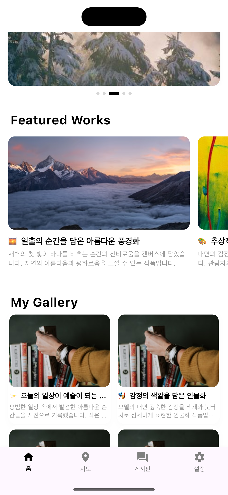
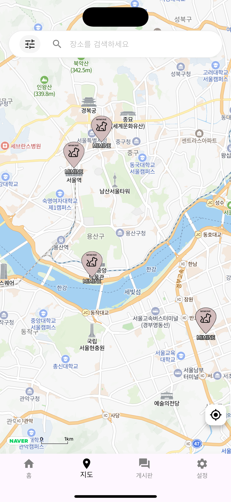
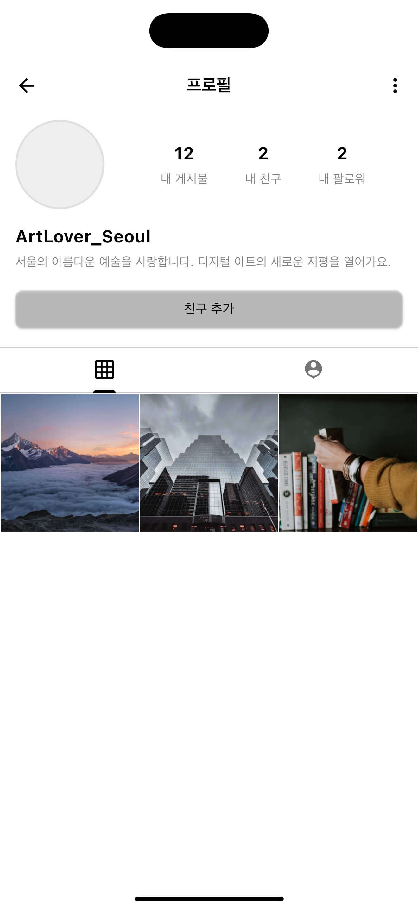

# MI-MINE

<div align="center">
  
  <p>Mining Myself Commnunity App</p>
</div>

## 📱 App Info
- **App Name**: MI-MINE
- **Developer**: Joseph88
- **Flutter Version**: 3.32.7
- **Dart Version**: 3.8.1

## 🏗️ 아키텍처

### Clean Architecture + 기능 기반 구조

```
lib/
├── app/                    # 애플리케이션 레이어
│   ├── app.dart           # 메인 앱 위젯
│   ├── bootstrap.dart     # 앱 초기화
│   └── router/            # 네비게이션 및 라우팅
├── core/                  # 코어 레이어 (기능 간 공유)
│   ├── configs/           # 앱 설정
│   ├── core_di/           # 의존성 주입 설정
│   ├── services/          # 코어 서비스
│   └── utils/             # 유틸리티 함수
├── features/              # 기능 모듈
│   ├── auth/              # 인증 기능
│   ├── map/               # 지도 기능
│   ├── shell/             # 메인 셸/레이아웃
│   ├── splash/            # 스플래시 화면
│   └── user/              # 사용자 관리
└── common/                # 공유 컴포넌트
    ├── constants/         # 앱 상수
    ├── enums/             # 공유 열거형
    ├── styles/            # 앱 스타일링
    └── widgets/           # 재사용 가능한 위젯
```

## 📁 기능 구조
```
feature_name/
├── presentation/
│   ├── cubits/         # Cubit 상태 관리
│   ├── pages/          # 화면 위젯
│   └── widgets/        # 기능별 위젯
├── domain/             # 비즈니스 로직 (향후)
├── data/               # 데이터 레이어 (향후)
└── feature_di/         # 기능 의존성 주입
```

## 📸 주요 기능

### 🏠 메인 화면
<div align="center">
  
  <p>직관적인 메인 화면으로 앱의 모든 기능에 쉽게 접근하세요</p>
</div>

### 🗺️ 지도 기반 마이닝 스팟
<div align="center">
  
  <p>위치 기반으로 마이닝 스팟을 찾고 공유하세요</p>
</div>

### 👥 커뮤니티
<div align="center">
  
  <p>다른 마이너들과 정보를 공유하고 소통하세요</p>
</div>

## 📱 앱 스크린샷

<div align="center">
  
  
  
</div>

